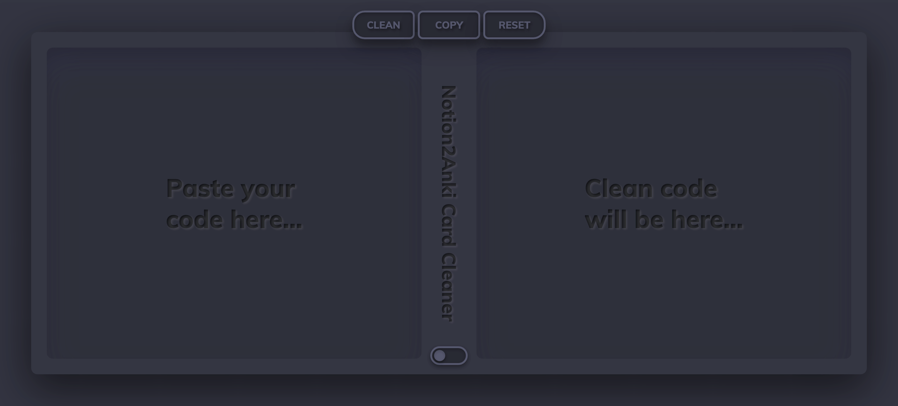

# Notion2Anki Card Cleaner

This tool automates the cleanup of [Anki] flashcards imported from [Notion2Anki], removing HTML artifacts that break card styling and formatting.

> [!NOTE]
> **I just switched to [Mochi]**
>
> My workflow with Notion, Notion2Anki, and Anki was still causing a lot of friction, until I discovered Mochi. This excellent alternative to Anki natively supports markdown, which simplifies my process significantly. I highly recommend it to anyone who needs to deal with code blocks in their flashcards.
>
> Therefore, I'm no longer using or maintaining this tool. However, I'm leaving it here for those who might still find it useful, whether to use it as-is or to modify it according to their needs.

## Motivation

This tool automates a crucial step in my personal study workflow, addressing a specific issue:

1. I create flashcards in [Notion] during study sessions.
2. I export these to HTML and use [Notion2Anki] to generate an [Anki] import file.
3. After importing, I replace code blocks with syntax-highlighted screenshots from [Carbon].
4. However, this process often breaks the card styling.
5. Previously, I had to manually clean the HTML artifacts to fix the styling.
6. This tool automates the cleaning process, saving significant time and effort.

## How to Use

1. Open the [CodePen] version.
2. Copy your Anki card code.
3. Paste it into the first input field.
4. Click "Clean".
5. Review the cleaned code. If it looks correct, proceed; if not, adjust as needed.
6. Click "Copy".
7. Replace your original Anki card code with the cleaned version.

## License

This project is licensed under the terms of the [MIT license].

[CodePen]: https://codepen.io/jorgecancinof/full/NWdBOMg
[Anki]: https://apps.ankiweb.net/
[Notion]: https://www.notion.so/
[Notion2Anki]: https://2anki.net/
[Carbon]: https://carbon.now.sh/
[Mochi]: https://mochi.cards/
[MIT license]: LICENSE
